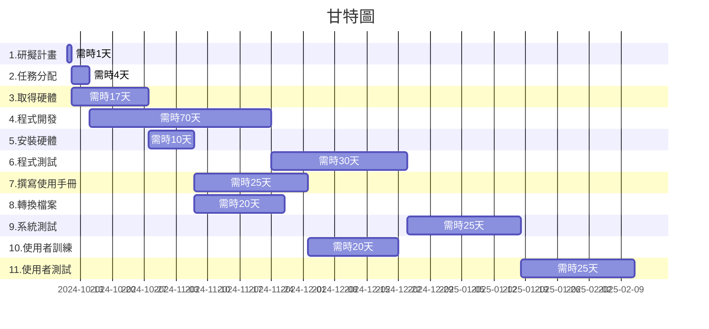

# hw2

### Mermaid

```mermaid
gantt
    title 甘特圖
    
    section 1.研擬計畫
    需時1天: 2024-10-10,1d
    
    section 2.任務分配
    需時4天 :2024-10-11,4d
    
    section 3.取得硬體
    需時17天 :2024-10-11,17d
    
    section 4.程式開發
    需時70天 :2024-10-15,40d
    
    section 5.安裝硬體
    需時10天 :2024-10-28,10d
    
    section 6.程式測試
    需時30天 :2024-11-24,30d
    
    section 7.撰寫使用手冊
    需時25天 :2024-11-7,25d
    
    section 8.轉換檔案
    需時20天 :2024-11-7,20d
    
    section 9.系統測試
    需時25天 :2024-12-24,25d
    
    section 10.使用者訓練
    需時20天 :2024-12-2,20d
    
    section 11.使用者測試
    需時25天 :2025-01-18,25d
    
```
